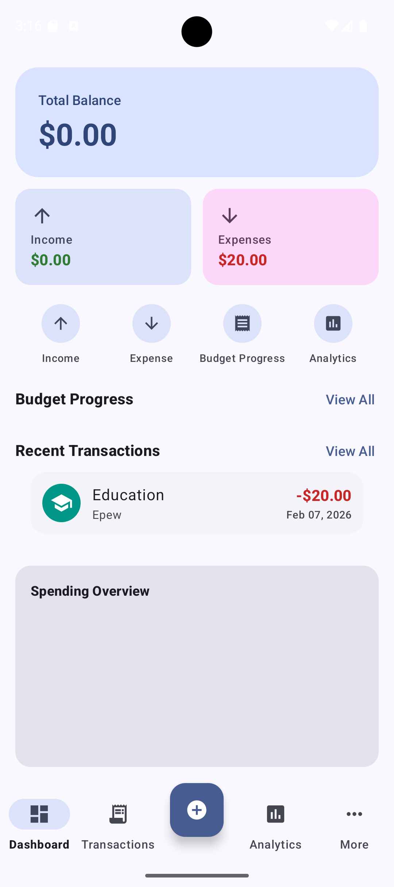
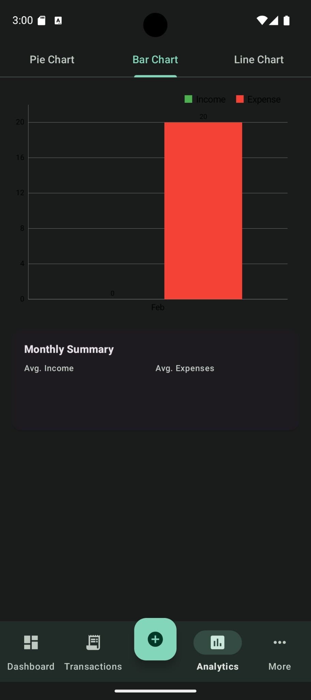

# WealthWise

A personal finance app for Android. Track your income and expenses, set budgets, see where your money goes, and get recommendations on how to spend smarter.

I built this because I wanted something straightforward that works offline but can still sync across devices when I need it to.

## What it does

- **Track transactions** — log income and expenses with categories, notes, and payees
- **Budgets** — set monthly spending limits per category, get alerts when you're close to going over
- **Recurring transactions** — set up bills and subscriptions once, the app creates them automatically
- **Analytics** — pie charts for category breakdown, bar charts for monthly comparisons, line charts for trends over time
- **Forecasting** — projects your income and spending for the next 7, 30, or 90 days using a mix of moving averages, linear regression, and weighted averages
- **Recommendations** — analyzes your spending and flags things like budget overruns, spending spikes, subscription creep, and low savings rate
- **Cloud sync** — optional Firebase sync so your data stays consistent across devices
- **Offline first** — everything works locally with Room. Firebase sync runs in the background when you have internet

## Screenshots

<p align="center">
  
  &nbsp;&nbsp;
  
</p>

## Tech stack

| Layer | What's used |
|-------|-------------|
| Language | Java 17 |
| Architecture | MVVM (ViewModel + LiveData) |
| Local DB | Room (SQLite) |
| Cloud | Firebase Auth + Firestore |
| Auth | Email/password, Google Sign-In |
| Charts | MPAndroidChart |
| Background | WorkManager |
| Navigation | Jetpack Navigation Component |
| UI | Material Design 3, ViewBinding |
| Min SDK | 26 (Android 8.0) |
| Target SDK | 34 |

## Project structure

```
com.wealthwise.app/
├── data/
│   ├── local/          # Room database, DAOs, entities, migrations
│   ├── model/          # Domain models and enums
│   ├── remote/         # Firebase Firestore, sync manager, DTOs
│   └── repository/     # Repository layer (single source of truth)
├── engine/
│   ├── forecast/       # Forecasting engine (moving avg, regression, weighted avg)
│   ├── recommendation/ # Spending analysis, rule-based advisor, trend detection
│   └── recurring/      # Recurring transaction processor
├── ui/
│   ├── auth/           # Login, register
│   ├── dashboard/      # Home screen with balance, recent transactions, budgets
│   ├── transaction/    # Transaction list, add/edit, filters
│   ├── budget/         # Budget list, add/edit
│   ├── category/       # Category management, icon picker
│   ├── recurring/      # Recurring transaction list, add/edit
│   ├── analytics/      # Pie, bar, and line chart fragments
│   ├── forecast/       # Forecast results screen
│   ├── recommendation/ # Recommendations screen
│   ├── settings/       # App settings (theme, sync, etc.)
│   └── common/         # Shared UI components (dialogs, helpers)
├── util/               # Formatting, date helpers, notifications, preferences
└── worker/             # WorkManager jobs (sync, recurring, budget alerts)
```

## How to build and run

**Requirements:**
- Android Studio (Arctic Fox or newer)
- JDK 17
- Android SDK with API 34 installed

**Steps:**

1. Clone the repo
   ```
   git clone <repo-url>
   cd WealthWise
   ```

2. Open the project in Android Studio and let Gradle sync

3. Set up Firebase (if you want cloud sync):
   - Create a project in [Firebase Console](https://console.firebase.google.com/)
   - Enable Email/Password and Google Sign-In under Authentication
   - Create a Firestore database
   - Download `google-services.json` and place it in the `app/` folder

4. Run the app:
   - Connect a device or start an emulator
   - Hit **Run** (or `Shift+F10`)

   Or from the terminal:
   ```
   ./gradlew installDebug
   ```

**Build APK only (no device needed):**
```
./gradlew assembleDebug
```
APK will be at `app/build/outputs/apk/debug/app-debug.apk`.

## Background workers

The app schedules three background jobs:

| Worker | Interval | What it does |
|--------|----------|--------------|
| `RecurringTransactionWorker` | Every 24h | Creates transactions from recurring entries that are due |
| `SyncWorker` | Every 6h | Pushes pending local changes to Firestore, pulls remote changes |
| `BudgetAlertWorker` | Every 12h | Checks budgets and sends a notification if you've hit 80% or 100% |

## Database

Five main tables:

- **TransactionEntity** — every income/expense entry
- **CategoryEntity** — expense and income categories (comes with 15 defaults)
- **BudgetEntity** — monthly budget limits per category
- **RecurringTransactionEntity** — templates for auto-created transactions
- **AccountEntity** — accounts like Cash, Bank (comes with 2 defaults)

Sync status is tracked per row (`PENDING` / `SYNCED`) so the app knows what to push to Firebase.

## Notes

- The app works fully offline. Firebase is optional — if you skip the `google-services.json` setup, local storage still works fine.
- Forecasting uses an ensemble of three methods and includes confidence intervals.
- Recommendations are rule-based, not ML. They look at your actual spending patterns and flag actionable stuff.
- Dark mode is supported via the settings screen.

